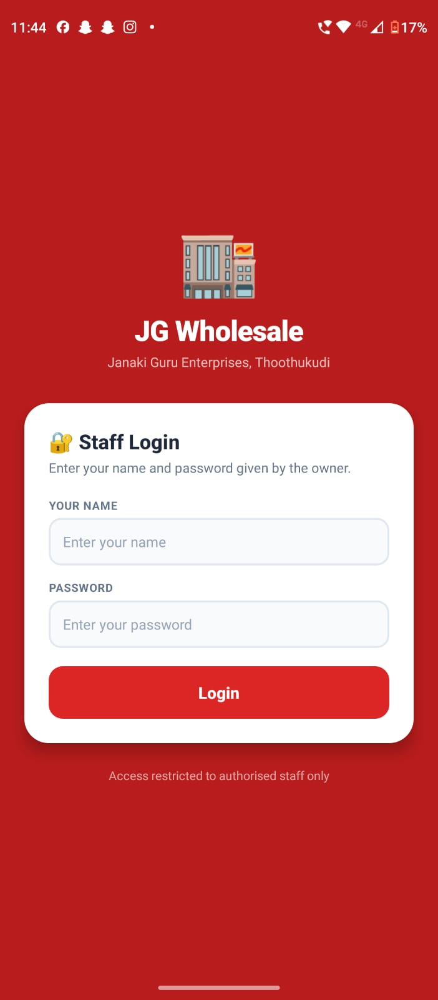
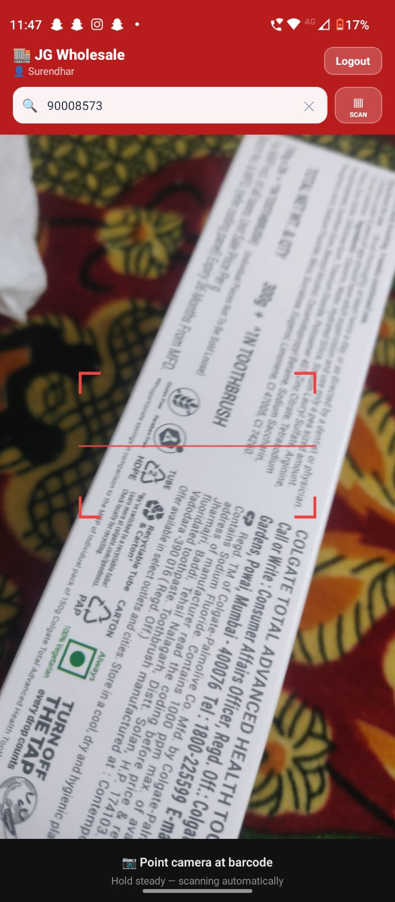
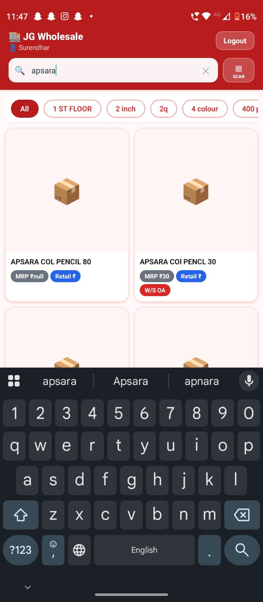
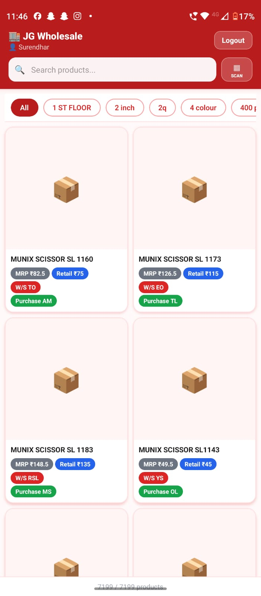

<h1 align="center">📱 JG Staff App</h1>

<h3 align="center">
Production wholesale staff application used for barcode lookup, pricing, and offline workflows
</h3>

<p align="center">


</p>

---

# 🌍 About The Project

**JG Staff App** is a production wholesale support application developed for **Janaki Guru Enterprises (Thoothukudi)**.

The app is designed for staff to:

✔ Scan product barcodes

✔ View business pricing

✔ Process wholesale workflows

✔ Access data offline

✔ Search products quickly

The application is deployed as:

📱 Android APK (TWA)

🌐 Progressive Web App (PWA)

and is currently used in daily operations.

---

# 🚀 Live Deployment

Web Version:

https://janaki-guru-wholesale.vercel.app/

---

# ✨ Core Features

## 📷 Barcode Scanning

Uses:

```text
BarcodeDetector API
```

Allows quick product retrieval through barcode scans.

---

## 📡 Offline Mode

Supports:

✔ IndexedDB caching

✔ Cached product lookup

✔ Reduced internet dependency

---

## 📱 Android APK

Generated via:

```text
PWABuilder (Trusted Web Activity)
```

Installed on staff devices.

---

## 🔐 Staff Authentication

Simple access system:

Name + Password

Owner-controlled credentials

---

## 💰 Vendor Pricing System

Displays:

- Multiple vendor prices
- Price visibility controls
- Staff-based restrictions
- Color-coded pricing pills

Supports:

```text
5 vendor prices per product
```

---

# 🛠 Tech Stack

Frontend:

React • TypeScript

Backend:

Supabase

Storage:

IndexedDB

Deployment:

Vercel

APK:

PWABuilder TWA

---

# 🖼 Screenshots

## Login Screen



---

## Barcode Scanner



---

## Product Lookup



---

## Pricing View



---


---

# 📈 Real Usage

Current status:

✅ Production

✅ Daily usage

✅ Installed on staff devices

✅ Supports business workflows

Approx users:

```text
40–50+
```

---

# 🔒 Security Notice

Staff credentials are confidential.

Public demo accounts are not provided.

Screenshots are shared instead.

---

# 🔮 Future Improvements

- Usage analytics
- Inventory synchronization
- Push notifications
- Sales summaries
- Order tracking

---

# 👨‍💻 Developer

**Mugash Priyan U**

M.Tech (Integrated) CSE - Data Science

SRM Institute of Science & Technology

GitHub:

https://github.com/umugash

---

⭐ If you found this project interesting, consider starring the repository.
